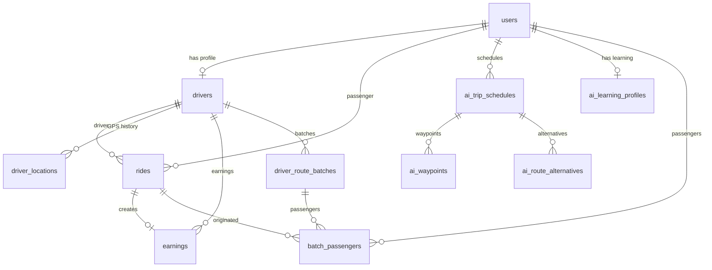

# Cau truc Database - DoAn3

## 11 Bang co trong he thong

### 1. Bang nguoi dung (users)
Bang chinh luu tru thong tin tai khoan tat ca nguoi dung (passenger, driver, owner, consultant...).

| Cot | Kieu du lieu | Rang buoc |
|-----|--------------|-----------|
| id | INT | PK, AUTO_INCREMENT |
| email | VARCHAR(255) | NOT NULL, UNIQUE |
| password | VARCHAR(255) | NOT NULL (bcrypt hash) |
| name | VARCHAR(255) | NOT NULL |
| phone | VARCHAR(20) | NULL |
| user_type | ENUM | 'passenger','driver','owner','consultant','hr_manager','revenue_manager' |
| rating | DECIMAL(3,2) | DEFAULT 5.00 |
| total_rides | INT | DEFAULT 0 |
| created_at | TIMESTAMP | DEFAULT CURRENT_TIMESTAMP |

### 2. Bang tai xe (drivers)
Ho so tai xe - moi tai xe co 1 record lien ket voi users.

| Cot | Kieu du lieu | Rang buoc |
|-----|--------------|-----------|
| id | INT | PK, AUTO_INCREMENT |
| user_id | INT | FK -> users.id, UNIQUE, NOT NULL |
| car_model | VARCHAR(100) | NULL |
| car_color | VARCHAR(50) | NULL |
| license_plate | VARCHAR(20) | NULL |
| is_available | BOOLEAN | DEFAULT FALSE |
| latitude | DECIMAL(10,8) | NULL (vi tri hien tai) |
| longitude | DECIMAL(11,8) | NULL (vi tri hien tai) |
| created_at | TIMESTAMP | DEFAULT CURRENT_TIMESTAMP |

**Lien ket:** users (1:1) - moi users co hoac khong co drivers

### 3. Bang chuyen di (rides)
Tat ca cac chuyen di - bao gom passenger, driver, trang thai.

| Cot | Kieu du lieu | Rang buoc |
|-----|--------------|-----------|
| id | INT | PK, AUTO_INCREMENT |
| passenger_id | INT | FK -> users.id, NOT NULL |
| driver_id | INT | FK -> drivers.id, NULL (chua co tai xe) |
| pickup_lat | DECIMAL(10,8) | NOT NULL |
| pickup_lng | DECIMAL(11,8) | NOT NULL |
| dest_lat | DECIMAL(10,8) | NOT NULL |
| dest_lng | DECIMAL(11,8) | NOT NULL |
| pickup_address | VARCHAR(500) | NOT NULL |
| dest_address | VARCHAR(500) | NOT NULL |
| vehicle_type | ENUM | 'motorbike','car_4_seats','car_7_seats' |
| distance_km | DECIMAL(8,2) | NOT NULL |
| duration_min | INT | NOT NULL |
| price | DECIMAL(10,0) | NOT NULL |
| status | ENUM | 'pending','accepted','arrived','in_progress','completed','cancelled' |
| driver_rating | TINYINT | NULL (1-5) |
| passenger_rating | TINYINT | NULL (1-5) |
| rating_comment | VARCHAR(500) | NULL |
| started_at | TIMESTAMP | NULL |
| completed_at | TIMESTAMP | NULL |
| created_at | TIMESTAMP | DEFAULT CURRENT_TIMESTAMP |

**Lien ket:**
- users (1:*) - moi users co nhieu rides lam passenger
- drivers (1:*) - moi drivers co nhieu rides
- earnings (1:0..1) - ride co hoac khong co earnings

### 4. Bang vi tri tai xe (driver_locations)
Lich su vi tri GPS cua tai xe.

| Cot | Kieu du lieu | Rang buoc |
|-----|--------------|-----------|
| id | INT | PK, AUTO_INCREMENT |
| driver_id | INT | FK -> drivers.id, NOT NULL |
| latitude | DECIMAL(10,8) | NOT NULL |
| longitude | DECIMAL(11,8) | NOT NULL |
| accuracy | DECIMAL(8,2) | NULL (do chinh xac GPS) |
| speed | DECIMAL(6,2) | NULL (m/s) |
| heading | INT | NULL (huong 0-360) |
| updated_at | TIMESTAMP | DEFAULT CURRENT_TIMESTAMP |

**Lien ket:** drivers (1:*) - moi driver co nhieu ban ghi vi tri

### 5. Bang thu nhap (earnings)
Thu nhap cua tai xe moi chuyen di.

| Cot | Kieu du lieu | Rang buoc |
|-----|--------------|-----------|
| id | INT | PK, AUTO_INCREMENT |
| driver_id | INT | FK -> drivers.id, NOT NULL |
| ride_id | INT | FK -> rides.id, NULL |
| amount | DECIMAL(12,0) | NOT NULL (VND) |
| type | ENUM | 'ride','bonus','penalty','withdrawal' |
| note | VARCHAR(255) | NULL |
| created_at | TIMESTAMP | DEFAULT CURRENT_TIMESTAMP |

**Lien ket:**
- drivers (1:*) - moi driver co nhieu earnings
- rides (0..1:1) - earnings co the co hoac khong co ride

### 6. Bang lich trinh AI (ai_trip_schedules)
Lich trinh di chuyen AI cho nguoi dung.

| Cot | Kieu du lieu | Rang buoc |
|-----|--------------|-----------|
| id | INT | PK, AUTO_INCREMENT |
| user_id | INT | FK -> users.id, NOT NULL |
| schedule_name | VARCHAR(255) | NOT NULL |
| scheduled_date | DATE | NOT NULL |
| total_estimated_time | INT | NULL (phut) |
| total_estimated_price | DECIMAL(12,0) | NULL (VND) |
| total_distance | DECIMAL(8,2) | NULL (km) |
| optimization_type | ENUM | 'time','cost','balanced' |
| ai_confidence_score | DECIMAL(3,2) | NULL (0.00-1.00) |
| traffic_condition | VARCHAR(50) | NULL |
| status | ENUM | 'planned','in_progress','completed','cancelled' |
| created_at | TIMESTAMP | DEFAULT CURRENT_TIMESTAMP |

**Lien ket:**
- users (1:*) - moi user co nhieu schedule
- ai_waypoints (1:*) - moi schedule co nhieu waypoint
- ai_route_alternatives (1:*) - moi schedule co nhieu phuong an

### 7. Bang diem dung (ai_waypoints)
Cac diem dung trong lich trinh AI.

| Cot | Kieu du lieu | Rang buoc |
|-----|--------------|-----------|
| id | INT | PK, AUTO_INCREMENT |
| schedule_id | INT | FK -> ai_trip_schedules.id, NOT NULL |
| stop_order | INT | NOT NULL (thu tu diem dung) |
| stop_type | ENUM | 'pickup','dropoff','stopover' |
| latitude | DECIMAL(10,8) | NOT NULL |
| longitude | DECIMAL(11,8) | NOT NULL |
| address | VARCHAR(500) | NOT NULL |
| stop_name | VARCHAR(255) | NULL |
| estimated_arrival | TIME | NULL |
| duration_min | INT | NULL (thoi gian dung) |
| distance_from_prev | DECIMAL(8,2) | NULL (km) |
| is_optional | BOOLEAN | DEFAULT FALSE |
| priority | INT | DEFAULT 0 |
| estimated_price_segment | DECIMAL(12,0) | NULL (VND) |

**Lien ket:** ai_trip_schedules (1:*) - moi schedule co nhieu waypoints

### 8. Bang tuyen thay the (ai_route_alternatives)
Cac phuong an tuyen duong thay the do AI de xuat.

| Cot | Kieu du lieu | Rang buoc |
|-----|--------------|-----------|
| id | INT | PK, AUTO_INCREMENT |
| schedule_id | INT | FK -> ai_trip_schedules.id, NOT NULL |
| route_name | VARCHAR(100) | NOT NULL |
| total_distance | DECIMAL(8,2) | NOT NULL (km) |
| total_duration | INT | NOT NULL (phut) |
| total_price | DECIMAL(12,0) | NOT NULL (VND) |
| route_description | TEXT | NULL (mo ta tuyen) |
| is_recommended | BOOLEAN | DEFAULT FALSE |
| traffic_scenario | VARCHAR(50) | NULL |

**Lien ket:** ai_trip_schedules (1:*) - moi schedule co nhieu alternatives

### 9. Bang ho so hoc tap AI (ai_learning_profiles)
Ho so hoc tap AI cua nguoi dung - luu tru preferences.

| Cot | Kieu du lieu | Rang buoc |
|-----|--------------|-----------|
| id | INT | PK, AUTO_INCREMENT |
| user_id | INT | FK -> users.id, UNIQUE, NOT NULL |
| preferred_time_start | TIME | NULL |
| preferred_time_end | TIME | NULL |
| average_trip_duration | DECIMAL(6,2) | NULL (phut) |
| average_trip_cost | DECIMAL(12,0) | NULL (VND) |
| total_distance_travelled | DECIMAL(10,2) | NULL (km) |
| frequent_locations | TEXT | NULL (JSON array) |
| avoid_locations | TEXT | NULL (JSON array) |
| preference_cost_vs_time | DECIMAL(3,2) | NULL (0=cost, 1=time) |
| model_version | VARCHAR(20) | NULL |

**Lien ket:** users (0..1:1) - moi user co hoac khong co profile

### 10. Bang chuyen gom (driver_route_batches)
Chuyen di gom nhieu passenger cua 1 tai xe.

| Cot | Kieu du lieu | Rang buoc |
|-----|--------------|-----------|
| id | INT | PK, AUTO_INCREMENT |
| driver_id | INT | FK -> drivers.id, NOT NULL |
| batch_name | VARCHAR(255) | NULL |
| status | ENUM | 'proposed','accepted','rejected','completed','cancelled' |
| total_revenue | DECIMAL(12,0) | NULL (VND) |
| total_distance | DECIMAL(8,2) | NULL (km) |
| passenger_count | INT | DEFAULT 0 |
| efficiency_score | DECIMAL(4,2) | NULL (0-100%) |
| ai_confidence | DECIMAL(3,2) | NULL (0-1) |
| accepted_at | TIMESTAMP | NULL |
| completed_at | TIMESTAMP | NULL |

**Lien ket:**
- drivers (1:*) - moi driver co nhieu batch
- batch_passengers (1:*) - moi batch co nhieu passenger

### 11. Bang hanh khach chuyen gom (batch_passengers)
Hanh khach trong chuyen gom.

| Cot | Kieu du lieu | Rang buoc |
|-----|--------------|-----------|
| id | INT | PK, AUTO_INCREMENT |
| batch_id | INT | FK -> driver_route_batches.id, NOT NULL |
| passenger_id | INT | FK -> users.id, NOT NULL |
| original_ride_id | INT | FK -> rides.id, NOT NULL |
| pickup_order | INT | NULL (thu tu don) |
| dropoff_order | INT | NULL (thu tu tra) |
| pickup_lat | DECIMAL(10,8) | NOT NULL |
| pickup_lng | DECIMAL(11,8) | NOT NULL |
| dropoff_lat | DECIMAL(10,8) | NOT NULL |
| dropoff_lng | DECIMAL(11,8) | NOT NULL |
| estimated_pickup_time | TIME | NULL |
| detour_km | DECIMAL(6,2) | NULL (km vuot dinh muc) |
| price_adjustment | DECIMAL(12,0) | NULL (VND, am/duong) |
| status | ENUM | 'pending','picked_up','dropped_off','cancelled' |

**Lien ket:**
- driver_route_batches (1:*) - moi batch co nhieu passenger
- users (1:*) - moi passenger la 1 user
- rides (1:*) - moi passenger co 1 ride goc

---

## Quan he giua cac bang

### User & Driver
```
users (1) --||--o| (0..1) drivers
```
- 1 users co 0 hoac 1 drivers (neu la tai xe)
- 1 drivers bat buoc phai co 1 users

### Ride (Chuyen di)
```
users (1) --||--o{ (0..*) rides (passenger)
users (1) --||--o{ (0..*) rides (driver)
drivers (1) --o{ rides (driver)
rides (1) --o| earnings
```
- 1 user co nhieu rides lam passenger
- 1 driver co nhieu rides
- 1 ride co 0 hoac 1 earnings

### Driver Locations (GPS)
```
drivers (1) --||--o{ (0..*) driver_locations
```
- 1 driver co nhieu ban ghi vi tri GPS

### AI Scheduling
```
users (1) --||--o{ ai_trip_schedules
users (1) --||--o| ai_learning_profiles
ai_trip_schedules (1) --||--o{ ai_waypoints
ai_trip_schedules (1) --||--o{ ai_route_alternatives
```
- 1 user co nhieu schedule
- 1 schedule co nhieu waypoint va alternative
- 1 user co 0 hoac 1 learning profile

### Batch Trips (Chuyen gom)
```
drivers (1) --||--o{ driver_route_batches
driver_route_batches (1) --||--o{ batch_passengers
users (1) --||--o{ batch_passengers
rides (1) --||--o{ batch_passengers
```
- 1 driver co nhieu batch
- 1 batch co nhieu passenger
- 1 passenger la 1 user
- 1 passenger co 1 ride goc

---

## Mo hinh ERD (Mermaid)


